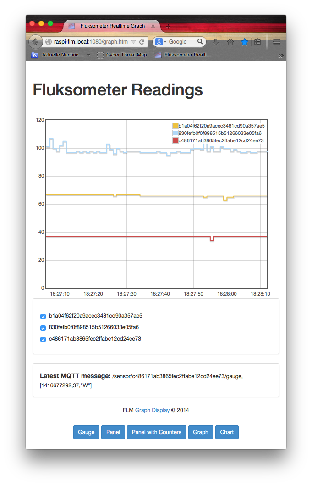

#flmdisplay

Visualization hacks for the Fluksometer

##Content

This repository contains the collected scripts implemented to persist and visualize readings from the [www.flukso.net](http://www.flukso.net) provided Fluksometer, an open source, community smart metering appliance.

It actually is a fork of the 
[energyhacks](http://github.com/gebhardm/energyhacks/tree/master/RaspberryPi)
variant to keep up with evolving reuse components, for example [socket.io](http://socket.io).

All folders contain a **README** file that describes the intention of the contained script and its usage.

Note that *css/* and *js/* folders are just script storages of reuse components without further information - on these you have to use the original sources and respect the corresponding licences...

Make sure that the web serving folders have access to these folders via symbolic links (Windows seems to break them). If the links do not exist, remove the *css* and *js* "file" (*rm css && rm js*) and reestablish the required symbolic links (*ln -s ../css/ css && ln -s ../js/ js*) - otherwise the required JavaScript libraries will not be found...

Note that as also this code evolves, there are different releases denoting different stages or sets of features provided along the development.

See the respective [release menu in github](https://github.com/gebhardm/flmdisplay/releases) or have a look with '**git tag**' - check out the version to your
convenience.

##Default
For a default use, go to the [*combined*](combined) folder that also contains information on how to prepare a computer, laptop or Raspberry Pi for usage.

##A "better" solution
With the upcoming v2.4.x firmware release of the Fluksometer there are some very interesting features that lead to installing persistence and visualization directly on the FLM. For this purpose development on this repository will rather not be evolving, but its successor [flmlocal](http://github.com/gebhardm/flmlocal) that provides all you need to make a full-fledged visualization without the need for an extra web server
.
##Licenses

All code provided under the respective licences; if not denoted otherwise the [MIT license](http://opensource.org/licenses/MIT) is the one to care about...

(c) 2014/2015, Markus Gebhard, Karlsruhe
