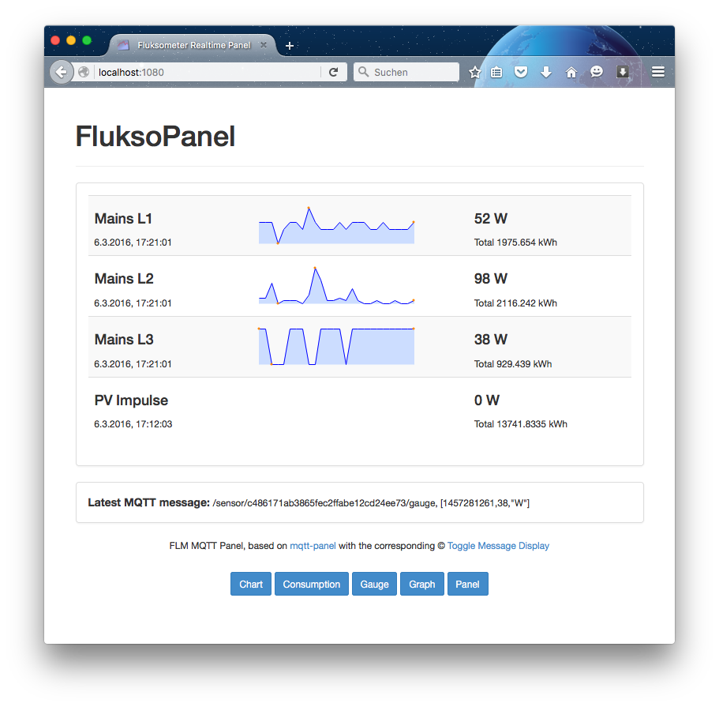

# About

*serve_flmdata.js* is a Javascript script running on **node.js** to receive and persist Fluksometer readings in a database and visualizing them in a panel and chart web service - so it needs [node.js](http://nodejs.org) installed...
It connects to the FLM's MQTT broker on the discovered IP address(es) using the multicast DNS service discovery - so there is no further configuration to change beside the required setup steps described in the following.

# Setup

To use the combined Fluksometer persistence and visualization script you have to perform some preparation steps. 

## Foundation

The following steps are based on a fresh installation of Raspbian/Debian on a [Raspberry Pi](http://www.raspberrypi.org/downloads). I chose the Jessie lite variant; it should also work with an equivalent, Debian-based PC installation.

## Installing the database

As the combined script stores Fluksometer data, a proper database must be installed; in my case it is SQlite. A previous use of MySQL quitted its cooperation.

	sudo apt-get install sqlite3

This installs the database and all dependent packages. Everything else is done from the serving script.

## Installing node.js

To run the persistence and visualization script install [node.js](http://nodejs.org). For this you may take the sources from [http://github.com/nodejs/node](http://github.com/nodejs/node) and compile it on your Raspberry Pi. Use following command sequence - make sure to select the branch to your convenience

	cd ~
	git clone http://github.com/nodejs/node
	cd node
	git checkout <the node.js release you want to install>
	./configure
	nohup make &
	
This will take some while; to check what the make process is doing, use
	
	tail nohup.out
	
After finished `make` install node on your computer.
	
	sudo make install

Note again, that the make process takes quite some while on a RasPi, so be patient; you may start the *make* process also directly (thus, without *nohup* and *&*); I chose to run it in the background with "*nohup make &*" allowing a logoff during processing. By the *tail* command you may have a look what’s currently going on. You'll recognize a finished *make* either if the *nohup.out* does not increase any further or the *tail* provides evidence that the *make* ended after all its compiling steps - if there where errors, hey, [Google is your friend](http://www.giyf.com)...
 
After the *sudo make install* check if node was installed properly 

	node -v
	npm -v

This shows the respective versions of *node* and the *node package manager*. Or it shows that your `make` failed (grmph) - therefore:

As an easy alternative **you may obtain a precompiled installation from [Adafruit Industries](https://www.adafruit.com/)**; follow the [description](https://learn.adafruit.com/node-embedded-development/installing-node-dot-js).

## Getting the script and starting it

Now the preparation is finished and you may continue with the actual Fluksometer service. Install it via *git*

	cd ~
	git clone http://github.com/gebhardm/flmdisplay

To use *mdns* with *npm* on a Raspberry Pi you need to have installed also the avahi compatibility library.

	sudo apt-get install libavahi-compat-libdnssd-dev

Now install the required mqtt, mdns, sqlite3, and socket.io modules by executing 

	cd flmdisplay
    npm install
    
utilizing the provided [package.json](package.json) file.

Be aware that these modules evolve; there was an issue with incompatible changes using socket.io: v0.9 behaves differently than v1.0 - so, even though I tested the stuff, it may not work with a next version of the used modules... Again, as this is free stuff, help yourself finding out what's up - there are zillions of possibilities, what has happened. (Have you used **git checkout**? Have you called **./configure**?)

As *mdns* uses a compatibility layer, be aware that it throws warnings on use; follow the links within the warnings to get an understanding what has happened (and then ignore them). 

To start the combined persistence and visualization service, run the provided start script, that pushes the exeuction into the background

	./flmdata.sh

As an alternative you may also run it using `node serve_flmdata.js`.

After start, the script checks if the corresponding database exists; if not, it creates the corresponding files and tables. Now the script discovers the existing Fluksometer MQTT broker(s) and subscribes to the respective sensor topics.

If there is no message that your FLM was detected (the message shows the IP address and the corresponding port) something went wrong with the mDNS installation; check this - again, [Google is your friend](http://www.giyf.com)...

On detection of one or more Fluksometers, the script starts to insert received values (i.e. mqtt messages on topic **/sensor/+/gauge**) into the database for later retrieval, e.g. by the chart. 

With the script also a web server is started that you can reach on the (RasPi’s) IP address from any computer in the LAN; access the visualization on port 1080

	http://"RasPi IP address":1080

Note that the service also advertises its existence; check with a Bonjour browser; so alternatively you may access the service also (at least on a Mac) via

	http://raspberrypi.local:1080

This assumes that you kept the default hostname; it may be different if you changed it, for example during *raspi-config*.

That's it. Now you should have an up and running local Fluksometer data visualization with gauge, panel, graph, and chart.

##A "better" solution
From the Fluksometer's v2.4.x firmware release there are some very interesting features that lead to installing persistence and visualization directly on the FLM. For this purpose development on this repository will rather not be evolving, but its successor [flmlocal](http://github.com/gebhardm/flmlocal) that provides all you need to make a full-fledged visualization without the need for an extra web server.

##Licenses

All code provided under the respective licences; if not denoted otherwise the [MIT license](http://opensource.org/licenses/MIT) is the one to care about...

(c) 2014-2016, Markus Gebhard, Karlsruhe