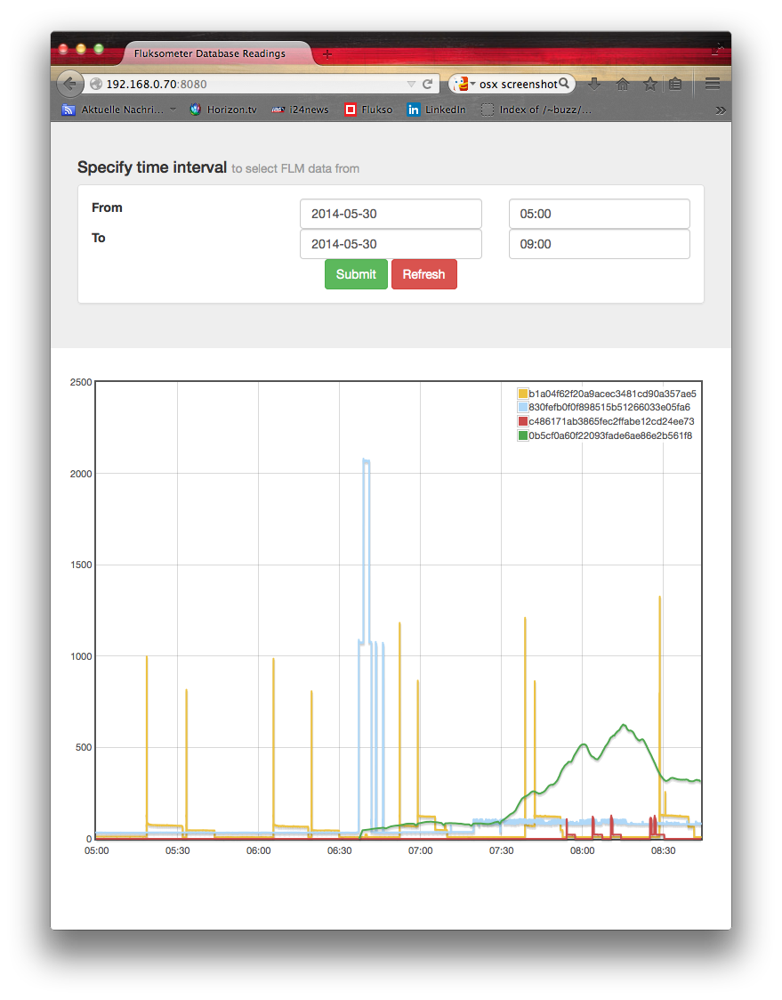

#FLM Chart

This is an alternative chart display for Fluksometer data stored in a database; it purely uses the socket connection to transfer data.
This script relies on the fact that the persist_mqtt.js is running and corresponding table flmdata is available in the mySQL database flm - see [../persist](../persist) for details.

Running *./chart.sh* starts a node.js based web server serving a page on port 8080 on the host's IP address. Access it by http://\<host ip\>:8080 (you may alter the listened to port to your convenience in the code of *serve_chart.js*)

Make sure node modules **mysql** and **socket.io** are installed; if they are not installed (actually they should be installed already as otherwise the persist service cannot be working), install them using *npm install mysql socket.io*.

Displaying the served page, press the "refresh" button to get the current date settings (and a clue on the format) in the input fields. On submit the corresponding database query is performed and values are displayed in a flotchart - up to 2 hours on second base; above 2 hours averaged on minute base. Note that there is a retrieve limit of around 12 hours continuous data; this does not take extremely long, but also "normally" triggers a memory overflow on browser side... (I also experienced that the server stops, but didn't dig into this so far)

As a gimmick you can use your mouse to select a smaller interval within the displayed graph that will lead to a more detailed view on this selection. Below the graph a button "reset" is shown to return to the initial selection - this works browser based; there is no roundtrip to the server or database.

The display of the graph scales with the window width and tries to reach a 4:3 ratio, optimally viewed on an iPad, Nexus 7 or Kindle Fire.

Markus Gebhard, Karlsruhe, May 2014 (c) MIT License - as is...
