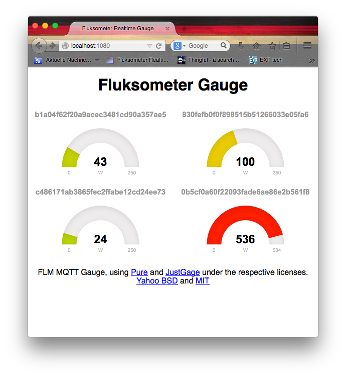

This is an alternative Fluksometer gauge visualization using the [Yahoo Pure CSS](http://purecss.io). 
It is yet in an experimental stage.

#Variant A

The first variant is the classic approach setting up a node.js web server that receives ([Fluksometer](http://flukso.net)) MQTT messages and passes them on via socket.io. 
To use this, you have to install [node.js](http://nodejs.org) together with the modules "mqtt" (the MQTT bindings), "socket.io" (for the web frontend communication) and "mdns" (for detecting the FLM's MQTT broker).

If you use another setup (for example, non-FLM gauges and a non-advertising MQTT broker) the mdns-part needs to be changed to a manual internet address... as follows:

`var mqttclient = mqtt.createClient(service.port, service.addresses[0]);`

becomes

`var mqttclient = mqtt.createClient('<broker port, usually 1883>', '<broker ip address, usually the address of the computer e.g. Mosquitto is running on>')`

Now you can start the ./gauge.sh and see gauges via the default index.html on localhost:1080.

#Variant B
With upcoming firmware versions of the Fluksometer (> v2.4) it will have websocket support onboard. Thus the socket.io becomes obsolete and mqttws31.js is used instead. For this a plain web server is required to serve gauge.html plus its included .js and .css files (from the respective folders). If you have set up variant A, you may test this with an v2.4-FLM instantly by pointing your browser to localhost:1080/gauge.html

Next step here is to bring the corresponding files (gauge.html and flm.logic.js plus includes) directly on the FLM - to be continued.

#FLM local variant
There is a complete folder that may be directly deployed in a Fluksometer v2.4.x web server folder. Folder [FLMlocal](FLMlocal/) contains all files necessary to make an FLM display the above gauges directly. Copy the content of the folder (the **/www/** directory) onto your Fluksometer - you do this most efficiently by using command **scp** on a linux machine or Mac (use WinSCP on a PC)

`scp * root@<flm ip address>:/www/`

You are asked for the FLM's root-password to copy the files onto it. After copying you can access the gauges by

`<flm ip address>/gauge.html`

from your browser.
