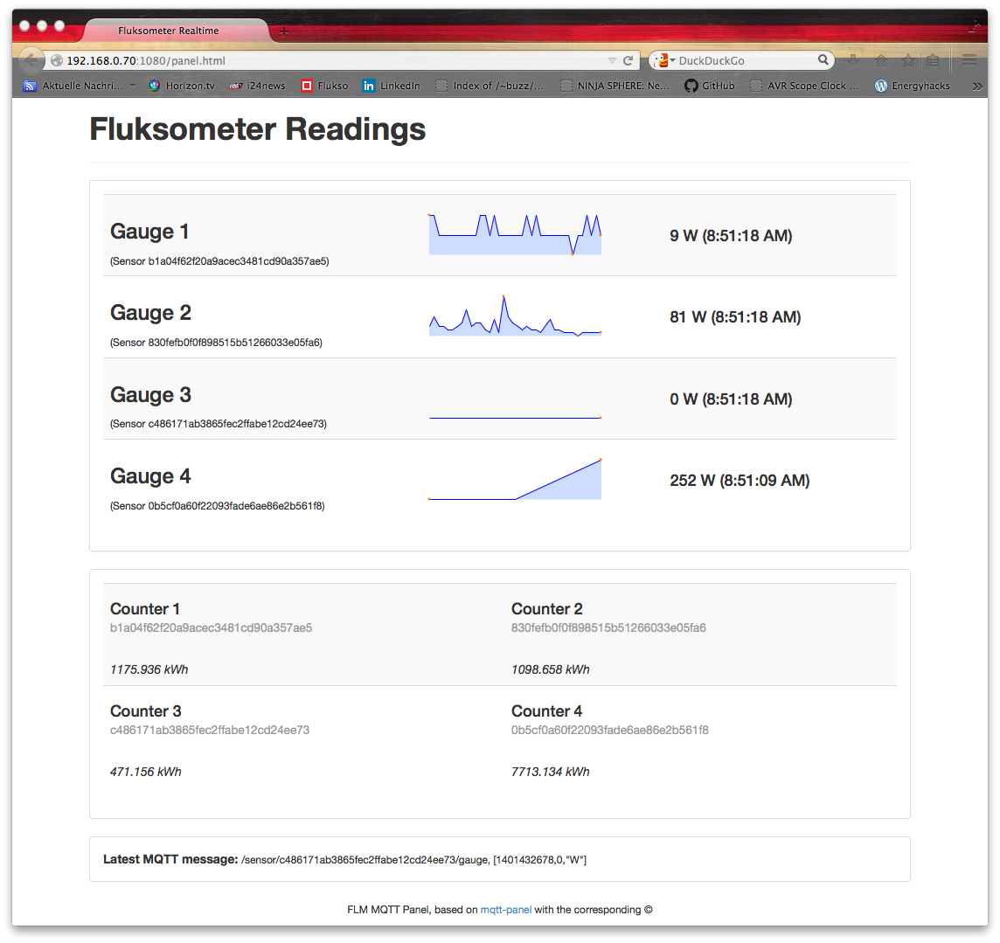
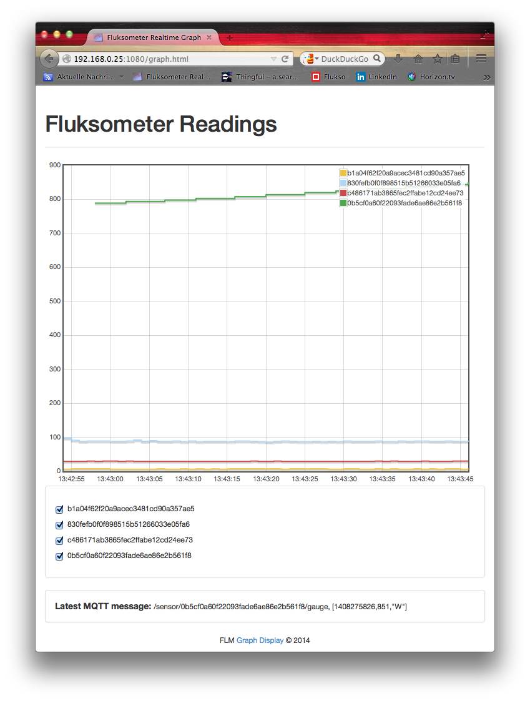

#FLM Panel

An MQTT-panel adaptation to the [Flukso](http://www.flukso.net) Fluksometer.

*serve_panel.js* is a JavaScript script running on node.js. It serves as a MQTT message to socket.io pipe with an integrated simple http server. The provided default page (index.html) displays data of all retrieved FLM sensor gauges; the alternative panel.html page includes additionally counter subtopics and the graph.html page shows a corresponding [flotcharts](http://flotcharts.org) diagram.

##Data retrieval

The panel is capable to display realtime data from FLM sent MQTT messages using the format

	topic: /sensor/"sensor id"/gauge payload: [timestamp,value,unit]

It is also capable to display messages provided by other MQTT publishers through the FLM's MQTT broker with the same format as above or the simpler format

	/sensor/"sensor id"/gauge value
	/sensor/"sensor id"/gauge [value,unit]

denoting the sensor-topic with gauge and an ID plus a payload of single value, single value with unit, and timestamp, value and unit. The latter may easily be published by, for example, an Arduino based sensor, for example on temperature or air pressure (see for example the [AVRNetIO MQTT sensor](https://github.com/gebhardm/energyhacks/tree/master/AVRNetIOduino/AVRNetIO_MQTT)).

Using the "panel.html" (http://"server ip":1080/panel.html) also shows the MQTT messages with the format

	/sensor/"sensor id"/counter [timestamp, value, unit]

as provided by the FLM.

##How to use

To run the script you need to have node.js installed. If not already done, get the sources from http://github.com/joyent/node and install it using the command sequence
	
	git checkout v0.10.29-release
	./configure
	make
	sudo make install

Install the mqtt, mdns, and socket.io modules with

	npm install mdns mqtt socket.io

Be aware that these modules evolve; there was an issue with incompatible changes using socket.io. Here v0.9 behaves differently than v1.0. So, even though I tested the stuff, it may not work with a next version of the used modules...

Important note: To install mdns with npm on a Raspberry Pi you need to have installed also the avahi compatibility library (note that mdns  throws some warnings on usage):

	sudo apt-get update
	sudo apt-get install libavahi-compat-libdnssd-dev

##Usual execution

On a running node.js installation just run the 

	./panel.sh 

script to start the server. 

Note that with using *mdns*, the multicast DNS service discovery, the Fluksometer's MQTT broker address(es) is (are) discovered automatically by *serve_panel.js*. So there is no further configuration needed (again, be aware of version incompatibilities within the environment used!)

Point your wherever located browser to the web server's IP address port 1080, in my example *http://192.168.0.70:1080* - the *index.html* page is loaded; to jump to *panel.html* and *graph.html* use the buttons at the page bottom.

Note: You may change the serving http port in *serve_panel.js*, *line 15*:

	var httpport = 1080;

The corresponding web server is advertised using mdns with name 'flmpanel'; so using Bonjour/mDNS you should easily be capable to find it on your network. 

Have fun.

Markus Gebhard, Karlsruhe, June/August 2014

##Graph display
To get a real-time experience there is a graph display that also allows switching off detected sensors. Play with it to your convenience; by default 5 minutes are displayed. I experienced that some device might don't like the amount of data kept locally, so you may change the displayed interval in the code of *flm.graph.js*, line 93:

	if ( diff > 300 ) {		// set the number of seconds to be shown

##Acknowledgements

With the greatest acknowledgements to Fabian Affolter and Ryan Florence...

The original MQTT panel by FabAff: [Github of FabAff](https://github.com/fabaff/mqtt-panel)

HTTP server part by Ryan Florence: [Gist message by Ryan Florence on serving web pages](https://gist.github.com/rpflorence/701407)

Also acknowledgements to the team providing the mDNS capability
on [Github of Agnat](https://github.com/agnat/node_mdns)

All code, corresponding to the sources, under [MIT-license](http://mit-license.org/).

Note: The script and html works also in other environment with node.js is installed; the screenshots are actually taken on my iMac...